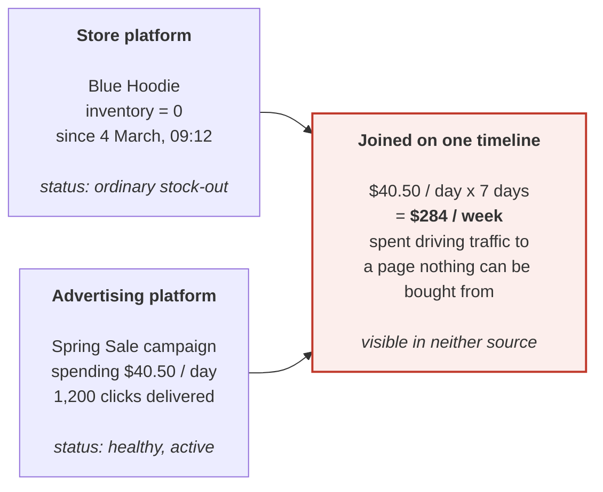
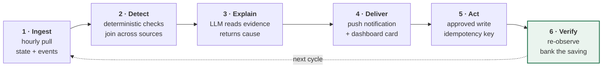
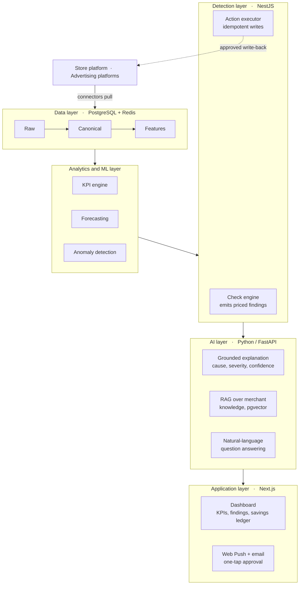
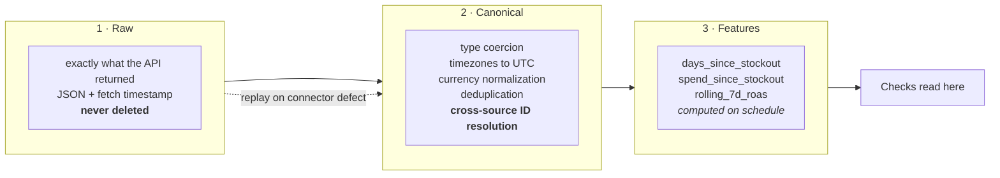
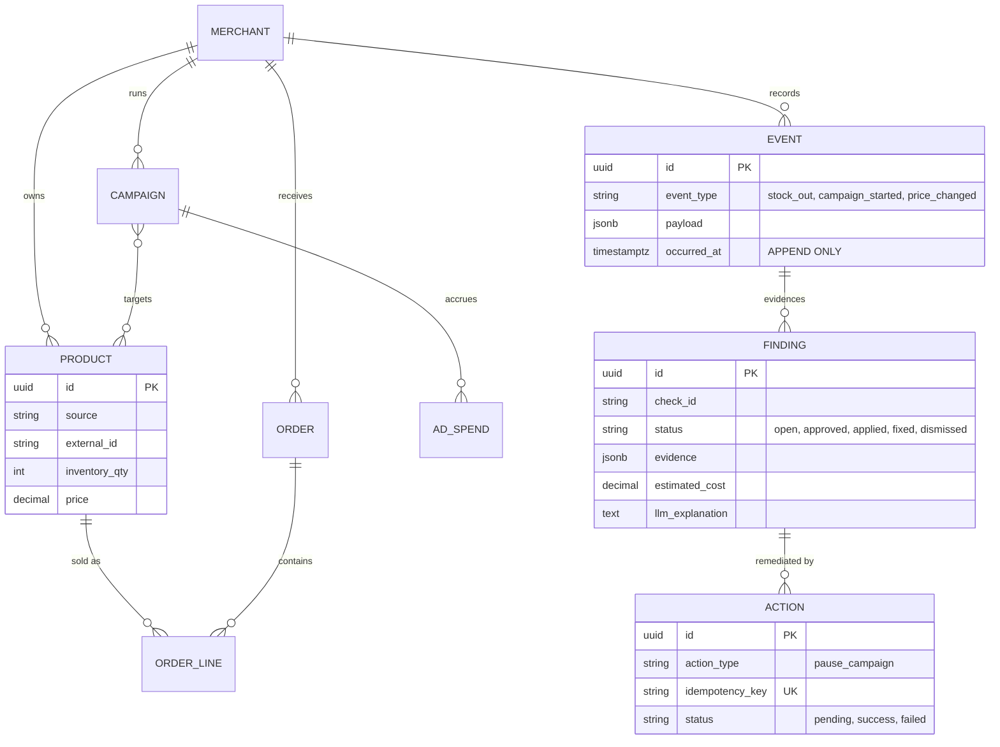
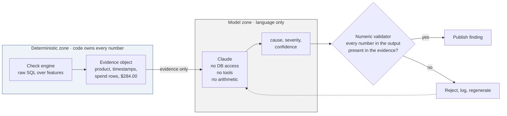
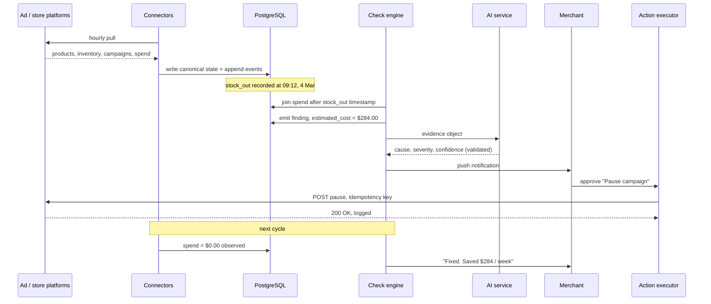
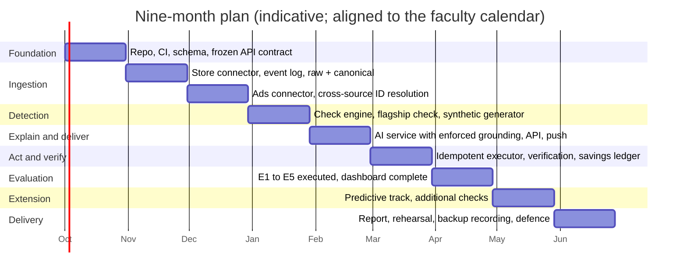

# Store Advisor

### An AI-powered business intelligence and decision-support agent for e-commerce operations

**Graduation project proposal, academic year 2026 / 2027**

| | |
|---|---|
| University | Suez Canal University |
| Faculty | Faculty of Computers and Informatics |
| Department | Computer Science |
| Supervisor | Dr. Gehad Taher |
| Industrial sponsor | Datajar, Inc. (Berlin, Germany) |

---

## 1. Abstract

A merchant selling online runs on at least two systems that cannot see each other. The store
platform knows products, inventory, and orders; the advertising platforms know campaigns,
budgets, and daily spend. Each reports on itself correctly, and neither knows the other exists.
The most expensive failures in e-commerce live in that gap.

Store Advisor closes it. The system ingests both classes of source into one time-aware model,
runs deterministic checks that join across them, prices each problem in currency under a stated
attribution model, has a language model explain it from proven evidence only, and delivers it
to the merchant. On approval it executes the fix against the source platform, and on the next
cycle it confirms the loss stopped.

Business intelligence answers the question a user thought to ask. Store Advisor speaks first,
prices the cost of doing nothing, and acts with permission. The commitment that makes this
defensible is narrow and absolute: deterministic code finds every problem and computes every
number, and the language model only explains what has already been proven.

---

## 2. Problem statement

Small and medium merchants hold operational data across several platforms but lack the tools to
reason across them. Existing analytics require the operator to notice a problem, form a
hypothesis, and go looking. Nothing tells them about a loss they have not thought to check for.

Consider the case that drives our design.



Neither dashboard is wrong. The store shows a routine stock-out and the ad account shows a
campaign performing normally. The loss appears only when the two are joined on a shared
timeline, and that join is the technical substance of this project.

Three properties make the join hard.

**Identifier and semantic heterogeneity.** A product in Shopify, a catalogue item in a Meta ad
set, and a line item in an order feed are three representations of one commercial object with
no shared key. Reconciling them is an entity-resolution problem, and the flagship check returns
nothing without it.

**Temporal misalignment.** Inventory changes are instantaneous events, while advertising spend
arrives as daily totals in the ad account's own timezone, which routinely differs from the
store's. Answering "how much was spent after the product became unbuyable" means reasoning
below the granularity at which the data is reported.

**Attribution defensibility.** A claim of the form "this cost you $284" must rest on a model the
team can write down, defend in a viva, and bound. One unjustified figure destroys the
credibility of every other figure the system produces.

---

## 3. Objectives

| # | Objective | Success criterion |
|---|---|---|
| O1 | A source-agnostic connector interface, with two heterogeneous sources normalized into one canonical schema | Adding a third source requires zero changes to the check engine |
| O2 | An append-only event model that preserves when each state change occurred | Stock-out timestamps recoverable to the hour, normalized to UTC |
| O3 | A modular check engine and the flagship `ad_spend_on_oos` detector | Precision and recall both above 0.90 on a labelled benchmark |
| O4 | An explicit cost-attribution model | Mean absolute percentage error below 10% against simulated ground truth |
| O5 | Descriptive analytics: KPI engine and interactive dashboard | Revenue, growth, average order value, product and customer performance, refreshed hourly |
| O6 | Grounded natural-language explanation and question answering over the merchant's own data | 100% of numeric tokens traceable to evidence fields, verified automatically |
| O7 | Idempotent action execution against a live platform API | Zero duplicate effects under the retry and double-submission suite |
| O8 | A verification loop and a confirmed savings ledger | A finding reaches `fixed` only on independently re-observed evidence |
| O9 | Predictive detection that anticipates a leak before it costs anything | Usable stock-out forecast at a three-day horizon, measured by MAE on held-out data |

---

## 4. Scope

**Version 1 delivers** one store connector (**Shopify**) and one advertising connector
(**Meta Ads**); the canonical schema
and event log; the check engine with the flagship check; the KPI and dashboard layer; the
grounded explanation service; the REST API; a web client with push notification and one-tap
approval; one action type (`pause_campaign`); the verification loop and savings ledger; and
containerized deployment with continuous integration.

**Version 2, if version 1 finishes early,** adds further checks (dead stock still advertised,
return-on-ad-spend collapse, catalogue sync failure, price and margin inversion), the
predictive track in section 7, and further action types such as budget reduction and catalogue
exclusion.

The two platforms are named rather than left open. Shopify Partners issues free development
stores and Meta issues test ad accounts, so the system can be built and evaluated without
touching a real merchant's data, and Meta's Marketing API exposes campaign pause, which is the
one action version 1 executes. WooCommerce, Salla, Google Ads, and TikTok Ads are later
connectors against the same interface; adding one costs the check engine nothing, which is
exactly what O1 measures.

**Explicitly excluded.** Real merchant production data, since evaluation runs on synthetic data
and developer sandbox stores. Autonomous action without human approval. Any modification of the
sponsor's commercial codebase; the system is standalone.

One constraint is written into the plan deliberately: a single check is carried all the way
through the six-stage cycle before a second check begins. Breadth before depth is the primary
way a project of this shape fails, and the scope exists to prevent it.

---

## 5. Related work and positioning

Native platform analytics are single-source by construction and cannot express a cross-source
predicate. Attribution suites such as Triple Whale and Northbeam do unify store and ad data,
but they ship a dashboard: read-only, and the operator must notice the problem first. Cloud
advisory systems, chiefly AWS Trusted Advisor and Google Cloud Recommender, run the pattern we
adopt, namely scheduled checks producing prioritized and priced findings, but only over
infrastructure.

The closest system is our own sponsor, so we name it in the comparison rather than leave it to
a footnote. Datajar connects a merchant's store and ad accounts, answers questions in chat, and
its agent will pause an underperforming campaign when told to. Joining sources and writing back
to a platform therefore distinguish nothing on their own.

| Capability | Native analytics | Attribution suites | Cloud advisors | Datajar | Store Advisor |
|---|---|---|---|---|---|
| Joins independent sources | No | Yes | n/a | Yes | Yes |
| Explains the cause in plain language | No | No | No | Yes | Yes |
| Prices the problem in currency | No | Partial | Yes | No | Yes |
| Executes the fix on approval | No | No | Partial | Yes | Yes |
| Speaks without being asked | No | No | Yes | No | Yes |
| Verifies its own fix worked | No | No | No | No | Yes |

Two rows survive the comparison. Every system above acts only when addressed, apart from the
cloud advisors, which speak first but never check their own work, and none of them re-observes
the source to confirm a remediation landed. Store Advisor is scheduled rather than prompted,
and it will not mark a finding fixed until the following cycle has independently re-observed
the sources and seen the spend stop. Those two properties are the contribution, and section 10
measures both.

The work draws on entity resolution and record linkage for identifier reconciliation
(Christen, 2012); isolation-based anomaly detection (Liu, Ting and Zhou, 2008) and decomposable
forecasting (Taylor and Letham, 2018) for the predictive track; hallucination and faithfulness
in natural language generation, where the failure mode is documented and measurable (Ji et al.,
2023) and evidence-conditioned generation is the standard mitigation (Lewis et al., 2020); and
tool-using language agents under human oversight (Yao et al., 2023).

Our position on the last of those is deliberately conservative. Much recent work gives the
model authority over both reasoning and action, and we invert it: deterministic code owns
detection and every number, while the model is confined to the presentation layer, where a
mistake is visible and destroys nothing. Section 10 measures whether the confinement holds.

---

## 6. Proposed system

### 6.1 The six-stage cycle

Every finding the system produces passes through the same six stages.



Stage 6 is what separates an agent from a dashboard. A dashboard reports that something is
wrong; this system confirms the effect of its own remediation instead of assuming it, and only
then records the saving. It is also the centre of the final demonstration.

### 6.2 Layered architecture



Two interface rules govern extension, and they are the basis of the modularity claim in O1 and
O3. A new data source is a new connector and never a change to the check engine. A new check is
a new module and never a change to the engine core.

### 6.3 Data architecture

Raw API responses are never written straight into the working tables. Three layers sit between
the platform and a check.



Layer 2 is a core deliverable rather than housekeeping. If identifiers, timezones, and
currencies are not reconciled, the flagship join silently matches nothing, and the system
reports zero leaks while appearing perfectly healthy. That failure is invisible without the
labelled benchmark described in section 10.

The canonical model, keyed on merchant throughout:



The event log is the architectural keystone. Current-state tables can only say "stock is zero
now", whereas the log says "stock reached zero at 09:12 on 4 March and spending continued after
that instant". Only the second form allows the flagship predicate to be written at all.

### 6.4 The flagship detector and its cost model

The check `ad_spend_on_oos` fires when advertising spend is attributable to a product that
could not be bought at the time the spend occurred.

Let `C(p)` be the campaigns attributable to product `p`, `spend(c,d)` the reported spend of
campaign `c` on day `d`, `α(c,p)` the share of that campaign attributable to `p`, and `f(p,d)`
the fraction of day `d` during which `p` was out of stock, derived from the event log at hourly
resolution.

```
W(p) = Σ         Σ    spend(c, d) · α(c, p) · f(p, d)
     c ∈ C(p)   d ∈ D
```

Version 1 constrains the model for defensibility. We set `α = 1` for single-product campaigns
and attribute multi-product campaigns proportionally by catalogue share, recording the
assumption on the finding itself. Computing `f(p,d)` from event timestamps rather than assuming
it equals 1 is what makes the first and last day of an outage correct instead of overstated.

> **A deliberate limit.** `W(p)` is advertising spend directed at unbuyable inventory. It is
> not lost profit, because we cannot know what fraction of that traffic would have converted.
> The system reports the quantity it can prove and refuses to extrapolate to a counterfactual
> it cannot establish. Every finding carries its attribution assumptions beside its figure.

### 6.5 The grounded explanation layer



The rule is enforced rather than requested. A post-generation validator extracts every numeric
token from the model's output and rejects any response containing a number absent from the
input evidence; rejections are logged and regenerated, and the rejection rate is reported as a
metric in its own right, because it measures how often the confinement would have failed
without enforcement. Every prompt and response is persisted, which makes the language layer
auditable and makes prompt regressions detectable against a fixed evaluation set.

### 6.6 One finding, end to end



Approved actions are written as rows before execution, each carrying an idempotency key derived
from the finding, the action type, and the target entity. The executor is the only component
permitted to call a platform's write API, so a retried request, a duplicate submission, or a
double tap resolves to exactly one effect on the merchant's account.

---

## 7. Analytics and machine learning

The detection core is deterministic by design, and the machine learning work sits around it in
four tracks that all respect the same boundary: a model may propose, but only code may
quantify.

**Descriptive analytics.** The KPI engine computes revenue, sales growth, average order value,
product and customer performance, and sales by period and category, refreshed on the ingestion
schedule and served to the dashboard. It gives the merchant context around a finding rather
than the finding alone.

**Predictive detection.** Per-product demand models over order history project inventory
depletion, and a finding is emitted when a campaign's scheduled budget will outlive the
projected stock. Prophet (Taylor and Letham, 2018) is the baseline against classical
seasonal-naive methods, with XGBoost on tabular features where per-product history is thin.
Evaluation is mean absolute error of the depletion-date forecast on held-out periods.

**Anomaly-driven candidate generation.** Outlier-resistant baselines and Isolation Forest
(Liu, Ting and Zhou, 2008) over return-on-ad-spend and cost-per-acquisition series propose
candidates, which the deterministic layer then confirms and prices.

**Learned severity ranking.** Merchant approve and dismiss decisions form a labelled feedback
signal, and a ranking model trained on it orders findings by expected acted-upon value. The
verification loop supplies the ground truth for whether a recommendation was worth making,
which closes a loop rarely closed in practice: the system observes the outcome of its own
recommendations and uses it to improve the next ones.

Experiments across all four tracks are tracked in MLflow, so model comparisons are reproducible.

---

## 8. Technology

| Layer | Choice | Why this one |
|---|---|---|
| Backend, connectors, check engine, API | NestJS (TypeScript) | One language across services; the check engine drops to raw SQL through `prisma.$queryRaw` because the cross-source joins are past what an ORM should express |
| ORM and migrations | Prisma | Type-safe schema as a single source of truth |
| Queue and scheduling | BullMQ on Redis | Rides on Redis, which we already run; a separate broker is setup cost the project cannot justify |
| Input validation | Zod | Every API input and every connector output is checked at runtime |
| AI service | Python, FastAPI, Anthropic SDK (Claude) | Structured explanation with a strict output contract |
| Retrieval | pgvector inside PostgreSQL | RAG over merchant documents without operating a second datastore |
| Machine learning | scikit-learn, XGBoost, Prophet, MLflow | Established baselines with tracked experiments |
| Database | PostgreSQL 16 | The whole project is joins across sources over time, which is what a relational engine is for |
| Web client | Next.js (App Router), React Query, Tailwind | Dashboard and approval flow in one deployable, installable as a PWA |
| Notifications | Web Push (VAPID) with email fallback | Delivers the alert to the phone without a separate native application |
| Containers and CI | Docker, GitHub Actions | Green build required to merge |
| Deployment | Google Cloud Run | Container-native, scales to zero, sponsor-funded |
| Platform integrations | Shopify Admin API, Meta Marketing API | Both issue free developer sandboxes, so evaluation needs no real merchant data; Meta exposes campaign pause, the one action version 1 executes |

---

## 9. Methodology and timeline

Two-week sprints with planning at the start, written updates through the week, and a
demonstrable increment at the end. Work is tracked in Jira and nothing is built without a
ticket. One monorepo, feature branches off `main`, pull requests with at least one review, no
direct pushes, and a green CI build as the merge gate. A ticket is done when the code is
merged, the build is green, every acceptance criterion holds, and someone other than the author
has watched it work.

Design decisions are recorded with their reasoning at the time they are taken, and the final
report is written incrementally alongside the implementation by a named owner rather than
assembled in the last month.

For supervision we propose a one-page written progress note at the close of each sprint
covering what was completed, what is in progress, what is blocked, and what was decided, with
meetings at whatever cadence suits Dr. Gehad Taher.



Month 4 and month 6 are the two points at which the project's viability becomes decidable: the
first priced finding produced end to end, and the six-stage cycle closing. We propose both as
formal review points.

---

## 10. Evaluation plan

The system is evaluated as five separate claims, each with its own instrument.

| # | Claim under test | Method | Target |
|---|---|---|---|
| E1 | The detector finds real leaks and does not invent them | A synthetic generator injects known leak scenarios plus confounders: planned promotions, legitimate low stock, restocks. Detected is compared against injected. | Precision and recall ≥ 0.90 |
| E2 | The monetary figures are correct | Ground-truth wasted spend is known by construction in the generator; estimated is compared against actual. | MAPE ≤ 10% |
| E3 | The model never invents a number | Automated faithfulness check over every generated explanation, verifying each numeric token against the evidence object, plus blind clarity rating by non-technical evaluators. | 100% traceability; clarity ≥ 4.0 / 5 |
| E4 | Actions are safe and exactly-once | Fault injection: duplicate submissions, retries after timeout, concurrent approvals, partial failures. | Zero duplicate effects |
| E5 | The system is usable and timely | End-to-end latency from ingestion to notification, operating cost per finding, System Usability Scale with participants. | SUS ≥ 68 |

Evaluation runs on a parameterized synthetic generator producing store and advertising data
with injected, labelled leak scenarios, plus developer sandbox accounts on the real platforms
to confirm that connectors and write actions work against genuine APIs. No real merchant data
is used at any point. The generator is a deliverable in its own right, because it is what makes
precision, recall, and attribution error measurable at all; production data offers no ground
truth against which any of those could be computed.

---

## 11. Risks and mitigation

| Risk | Impact | Likelihood | Mitigation |
|---|---|---|---|
| Platform API access or write-scope approval is delayed | High | Medium | Apply for developer and sandbox access in week one, and build against recorded API fixtures so nobody is blocked; the sponsor holds existing platform relationships |
| Cross-source identifier resolution is harder than estimated | High | Medium | Scheduled first and explicitly owned; a manual mapping fallback keeps the demonstration viable while the automatic resolver matures |
| Scope expands beyond what the team can finish | High | High | One check end to end before any second check, a written exclusion list, and the supervisor asked to hold us to it |
| Language model cost or availability | Medium | Low | Explanations are cached per finding rather than regenerated, the interface is provider-agnostic, and the sponsor funds usage |
| A member blocked waiting on another member's service | Medium | High | The API contract is frozen early with fixtures, so clients build in parallel from day one |
| The live demonstration fails on the day | High | Medium | A recorded backup, a local offline mode, and a rehearsal on the actual presentation hardware |
| The report is left to the end | High | Medium | A named owner from week one, with sections written at the close of each sprint |

---

## 12. Team and deliverables

| # | Member | Owns |
|---|---|---|
| 1 | Ahmed Faraj | Team lead, system architecture, cloud and CI/CD, web dashboard |
| 2 | Ahmed Abdallah | The check engine, the detection core |
| 3 | Ahmed Essam | The advertising connector and service observability |
| 4 | Basem Essam | The canonical schema and the store connector, the data layer |
| 5 | Khaled Ghoniem | The AI service: grounded explanation, pricing, ranking, evaluation set |
| 6 | Mohamed Haggag | The public API and the finding and action contract |
| 7 | Omar Ali Abdelrady | Design system, findings and dashboard screens, the demonstration flow |
| 8 | To be assigned | Second engineer on the analytics and ML track, alongside Khaled Ghoniem |

The analytics and machine learning track opens in months 7 and 8, so the eighth seat blocks
nothing before April 2027. Khaled Ghoniem leads that track and already owns the ranking model
and the evaluation set. If the seat is still open in October, the work moves to people who need
it anyway: the KPI engine to Ahmed Faraj, whose dashboard consumes it; the synthetic data
generator to Ahmed Abdallah, whose check engine cannot be tested without it; and forecasting to
Khaled.

Everything waits on the canonical schema, so it lands first. The store connector defines the
connector interface that the advertising connector is then built against. The check engine
starts once the schema and one connector exist, and the AI service can begin on hand-written
findings before the engine is ready. Freezing the API contract early with fixtures is what
keeps the client work unblocked.

**Deliverables.** A deployed system covering the full six-stage cycle. Source code in a
repository with CI and documented architecture. The synthetic generator and the labelled
evaluation benchmark. Results for E1 to E5 with methodology and raw measurements. The written
report including design rationale and the record of decisions. A live demonstration with a
recorded backup. Technical documentation sufficient for a third party to add a new source or a
new check.

---

## 13. Ethics, safety, and sponsorship

**No real merchant data.** Development and evaluation use synthetic data or developer sandbox
accounts held by the team.

**No autonomous financial action.** Every write to an external platform requires explicit human
approval. There is no configuration in which the system acts unattended; this is a property of
the architecture rather than a setting.

**Auditability.** Every action, prompt, and model response is persisted, and any output can be
traced back to the rows that produced it.

**Credential handling.** Platform credentials live in managed secret storage, never in the
repository, scoped to the minimum permission each connector needs.

**Honest reporting.** The system reports what it can prove and declines to claim lost profit,
which it cannot establish.

**Industrial sponsorship.** The project is sponsored by Datajar, Inc., a Berlin-based company
building an AI analytics and agent platform for e-commerce, where the team lead is employed. The sponsor provides
cloud infrastructure and deployment funding, language model API access and usage costs,
developer platform accounts, and technical review from practising engineers. Store Advisor is
an independent standalone system in a separate repository: it reuses no sponsor source code and
processes no sponsor customer data. Section 5 states plainly where the sponsor's product and
this project overlap in capability, and where they do not. The academic work, the architecture,
and the implementation are the team's own.

---

## 14. Expected contributions

A working reference architecture for safe agentic action under financial authority, in which
quantification is deterministic and auditable and the language model is confined to the
presentation layer, with an enforcement mechanism and a measurement of how often that
enforcement is needed.

An explicit, bounded cost-attribution model for cross-source advertising waste, including a
stated refusal to extrapolate beyond what the evidence supports.

A closed detect, act, verify loop in which the system independently confirms the effect of its
own remediation, which none of the surveyed commercial systems implement.

A labelled synthetic benchmark for cross-source e-commerce leak detection, making precision,
recall, and attribution error measurable where production ground truth is unobtainable.

---

## 15. The demonstration

This sequence is the acceptance test for the project as a whole.

1. A phone receives a notification: *"You are burning $284 per week on ads for a sold-out product."*
2. Opening it shows the evidence: Blue Hoodie, out of stock since 4 March at 09:12. Spring Sale campaign, still spending $40.50 per day. 1,200 clicks to a page where nothing can be bought. Zero sales in six days.
3. The system explains the cause in plain language, grounded entirely in the figures above.
4. The merchant taps **Pause campaign**, and the system calls the real advertising API.
5. On the next cycle the system independently observes that spend has stopped, and the card turns green: *"Fixed. Saved $284 per week."*

If that sequence runs end to end against live sandbox accounts, the project has met its primary
objective.

---

## 16. References

1. P. Christen, *Data Matching: Concepts and Techniques for Record Linkage, Entity Resolution, and Duplicate Detection*. Springer, 2012.
2. F. T. Liu, K. M. Ting and Z.-H. Zhou, "Isolation Forest," *Proc. IEEE ICDM*, 2008, pp. 413 to 422.
3. S. J. Taylor and B. Letham, "Forecasting at Scale," *The American Statistician*, vol. 72, no. 1, pp. 37 to 45, 2018.
4. Z. Ji et al., "Survey of Hallucination in Natural Language Generation," *ACM Computing Surveys*, vol. 55, no. 12, 2023.
5. P. Lewis et al., "Retrieval-Augmented Generation for Knowledge-Intensive NLP Tasks," *NeurIPS*, 2020.
6. S. Yao et al., "ReAct: Synergizing Reasoning and Acting in Language Models," *ICLR*, 2023.
7. Amazon Web Services, "AWS Trusted Advisor Documentation."
8. Shopify, "Admin API Reference"; Meta, "Marketing API Reference."
9. J. Brooke, "SUS: A Quick and Dirty Usability Scale," *Usability Evaluation in Industry*, 1996, pp. 189 to 194.

---

*Store Advisor · Graduation project proposal · Suez Canal University, Faculty of Computers and Informatics, Computer Science Department · Submitted to Dr. Gehad Taher*
