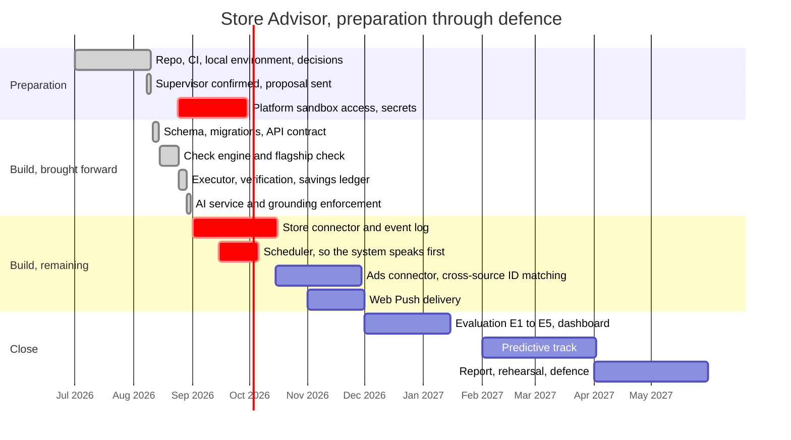

# Store Advisor: progress tracker

**Supervisor:** Dr. Gehad Taher · **Team:** Suez Canal University, Faculty of Computers and
Informatics, Computer Science

**Last updated:** 31 August 2026 · **Next update:** 13 September 2026 · **Owner of this file:** Ahmed Faraj

> This file answers one question: what is finished and what is not. It is updated at the close
> of every sprint, and the date above is always the truth about how current it is.

---

## Where we are today

Four of the six stages in the handbook run end to end. A merchant record goes in, a check finds
an advertising campaign spending against a product nobody can buy, the language model explains
the finding without touching the arithmetic, the merchant approves a pause, and the next run of
the engine observes that the spending stopped and closes the finding.

That last step is stage 6, and it is one of the two properties section 5 of the proposal claims
as the contribution. It works, and it is now covered end to end: 86 tests across the three
services, all green, with the language model's explanation refused in code if it invents a
number the check did not prove.

Since the last update the review queue emptied. The four pull requests listed here as waiting
are merged, and stage 3 among them, so the AI service is no longer a branch — it builds, boots
and answers in the same `docker compose up` as everything else. Two housekeeping items closed
with them: `main` is now protected in a way the repository enforces rather than the team
remembering, and the two branches that had drifted away from the project are gone, archived as
tags rather than deleted outright.

**The headline has not moved.** The proposal claims the system speaks without being asked,
meaning a schedule fires and a merchant hears about a problem they never thought to ask about.
There is still no scheduler in the repository, no queue, and no connectors. The pipeline runs
when a person types `npm run check:run`, against data a seed script wrote. Everything merged in
the last two days made the existing half sturdier; none of it made the missing half smaller.
Section 3 below says what that costs and what closes it.

| | Count |
|---|---|
| Done and merged | 24 |
| In review | 0 |
| Not started | 9 |
| Blocked or unowned | 4 |

---

## Timeline

Red bars are the two items that block the claim the proposal makes, plus the one preparation
item with an external deadline. Detection and action arrived roughly two months early, which
bought the room that ingestion and scheduling now need.

---

## Finished

Everything in this table is merged to `main` and covered by continuous integration.

| Item | Owner | Finished | Evidence |
|---|---|---|---|
| Monorepo structure: `backend`, `ai`, `web`, `infra`, `docs` | Faraj | 25 Jul 2026 | Repository |
| Continuous integration on GitHub Actions | Faraj | 25 Jul 2026 | `.github/workflows/ci.yml` |
| Local environment, PostgreSQL and Redis in Docker | Faraj | 25 Jul 2026 | `docker-compose.yml` |
| Architecture written end to end | Faraj | 25 Jul 2026 | `docs/HANDBOOK.md` |
| Tech stack decided at library level | Faraj | 25 Jul 2026 | `docs/STACK.md` |
| Ownership assigned, 7 of 8 members | Faraj | 25 Jul 2026 | `docs/ROLES.md` |
| Supervisor confirmed | Faraj | 8 Aug 2026 | Dr. Gehad Taher |
| Proposal written and submitted | Faraj | 10 Aug 2026 | `docs/PROPOSAL.md` |
| Canonical database schema and migrations | Basem Essam | 11 Aug 2026 | SCRUM-7, `backend/prisma/` |
| Check constraints, nullable budgets, constraint tests | Basem Essam | 12 Aug 2026 | SCRUM-7, review round |
| Service detection in the build pipeline | Basem Essam | 12 Aug 2026 | `ci.yml`, job `check-files` |
| API skeleton, `/health` and `/findings` | Ahmed Abdallah | 12 Aug 2026 | SCRUM-11 |
| CODEOWNERS, pull request template, grouped Dependabot | Faraj | 28 Aug 2026 | `.github/` |
| Image build and boot smoke test, migration drift detection | Faraj | 28 Aug 2026 | `ci.yml`, job `image` |
| Demo seed fixture | Faraj | 29 Aug 2026 | `backend/prisma/seed.ts` |
| Check engine and the `ad_spend_on_oos` check | Faraj | 29 Aug 2026 | `backend/src/checks/` |
| Action executor and stage 6 verification | Faraj | 29 Aug 2026 | `backend/src/actions/` |
| Findings dashboard against the real API | Faraj | 29 Aug 2026 | `web/` |
| Merchant-scoped campaign lookup and idempotency key | Faraj | 30 Aug 2026 | PR #13 |
| Lint and test gates that actually gate | Faraj | 30 Aug 2026 | PR #14, `ci.yml` |
| Stage 3: explanation with the grounding rule enforced in code | Faraj | 30 Aug 2026 | PR #15, `ai/`, `backend/src/explain/` |
| Repository documents realigned to the proposal | Faraj | 31 Aug 2026 | PR #16, `docs/PROPOSAL.md` |
| Branch protection on `main`, enforced by ruleset | Faraj | 31 Aug 2026 | Settings, Rules, Rulesets |
| Dependency queue cleared, incompatible majors held | Faraj | 31 Aug 2026 | PRs #24, #25, #29, `.github/dependabot.yml` |

## In review

Nothing. The queue is empty for the first time since it opened, and every pull request that was
listed here on 30 August is merged to `main` with a green pipeline behind it.

Worth recording how the four were reviewed, because "green CI authorises a merge" (handbook
section 8) is only honest if the pipeline is actually watching. Two of these fixed the pipeline
itself: #14 found that `npm run lint` ran `eslint --fix`, so lint repaired the code in the
runner, exited zero and threw the repair away — nine real errors had accumulated on `main`
behind a green tick — and that the web job never ran its tests at all. Both are closed, and the
ruleset now requires all five jobs, web and the AI service included.

## Not started

| Item | Owner | Opens | Why it matters |
|---|---|---|---|
| Store connector and the connector interface | Basem Essam | Sep 2026 | Nothing writes to `events` except the seed script, so the timeline the flagship check reads is fixture data |
| Scheduler, so a check fires on a timer | Ahmed Abdallah | Sep 2026 | Without it the system is prompted rather than scheduled, which is the Datajar column in the proposal's comparison table |
| Advertising connector | Ahmed Essam | Oct 2026 | The second source. Meta platform review is the long pole, not the code |
| Cross-source identifier resolution | Basem Essam | Nov 2026 | A store product identifier has to link to the product an advertising campaign targets |
| Web Push delivery and approval on a phone | Faraj | Nov 2026 | The demo opens with a phone buzzing, and nothing in the repository sends a notification |
| Synthetic data generator and labelled benchmark | Seat 8 | Dec 2026 | Evaluation E1 to E5 cannot run without labelled findings |
| Evaluation set for the language model | Khaled Ghoniem | Dec 2026 | Tells us when a prompt change has made explanations worse |
| Staging deployment on Cloud Run | Faraj | Dec 2026 | `infra/` is a README, and everything so far runs locally |
| Predictive track | Khaled Ghoniem | Feb 2027 | Months 7 and 8 in the proposal |

## Blocked or unowned

| Item | Why it matters | Needed by |
|---|---|---|
| **Platform developer and sandbox access** | Applications take weeks, and nothing can be tested against a real interface until they clear. Shopify development stores are free and immediate, so the store connector can start without waiting; Meta advertising access is the one with a genuine queue | Sep 2026 |
| **Report owner not named** | The written report is graded. Writing it from week one is the difference between a report and a scramble, and this gap has been open since the first version of this file | Sep 2026 |
| **Eighth team member not assigned** | A second engineer on the analytics and machine learning track. Not blocking: that track opens in February 2027, Khaled leads it, and section 12 of the proposal names the fallback split if the seat is still empty in October | Oct 2026 |
| **Check engine ownership not mapped in CODEOWNERS** | `/backend/src/checks/` falls through to the tech lead, so reviews of the core service are not routed to the person who owns it. The CODEOWNERS comment defers this until the directory lands on `main`; it landed on 29 August, so the only thing still missing is a confirmed GitHub handle for Ahmed Abdallah. One line, blocked on one answer | Sep 2026 |

---

## Risks worth stating plainly

**The system does not yet speak first.** Section 5 of the proposal argues that exactly two
properties survive comparison with existing systems, our sponsor included: the system is
scheduled rather than prompted, and it verifies its own remediation. Verification is built and
tested. Scheduling has no code at all, and neither do the connectors that would give a schedule
anything current to read. Judged against its own claim the project is halfway, and the missing
half is the cheaper one: the check engine was deliberately written as a standalone entry point
so that a queue can call the same code later without the engine changing shape.

**Detection is ahead of ingestion, which flatters the demonstration.** Every finding shown so
far comes from a seed script that writes exactly the rows the check is built to find. The join
across sources is real code against real SQL, but it has never run against data that arrived
from outside. Until a connector exists we cannot claim the check works, only that it works on
our own fixture.

**Work is concentrated, and this update made it worse.** Three of eight members have code
merged to `main`. Basem owns the schema and wrote most of the service detection in the
pipeline, Abdallah contributed the API skeleton, and the tech lead wrote the rest — including
the AI service, which belongs to Khaled on paper and in CODEOWNERS. Every one of the six items
added to the finished table above is the tech lead's. That was defensible in August, when the
alternative was an empty repository and a team waiting on an academic year that had not
started. It is not defensible in September, and the ratio is now the clearest number in this
file. Stages 1 and 4 are the two largest remaining pieces and both are unstarted, which makes
them the natural place to hand ownership back — not later, and not partially.

---

## How this file is kept current

At the close of each sprint the owner moves finished rows into the first table with a date and
a link, promotes the next items into the second, and revises the counts at the top. A separate
one-page sprint note goes into the shared folder covering what was completed, what is in
progress, what is blocked, and what was decided.

If a date slips, the row says so rather than quietly moving. A tracker that only ever shows
green is a tracker nobody believes. The 30 August update was that rule working in one
direction: the counts moved a long way at once because the file had been allowed to be wrong
for three weeks. This one is the same rule in the other direction — six items closed in two
days, and the section that matters still says the scheduler and the connectors do not exist,
because they do not.
